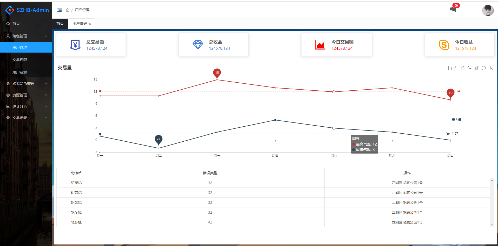

## 简化版 react-admin-antd

<p align="center">
  
</p>

## 项目目录

```
├── .vscode
├── node_modules
├── public
│ ├── favicon.ico
│ └── index.html
├── src
│ ├── api
│ ├── app
│ ├── assets
│ ├── components
│ ├── images
│ ├── layout
│ ├── router
│ ├── store
│ ├── theme
│ ├── utils
│ ├── views
│ ├── App.js
│ └── index.js
├── .env.development
├── .env.production
├── .eslintignore
├── config-coverrides.js
├── package.json
├── README.md
└── yarn.lock

```

## Getting started

```bash
# clone the project
git clone https://github.com/frontend-qin/react-antd-admin.git

# enter the project directory
cd react-antd-admin

# install dependency
yarn install

# develop
yarn start
```

This will automatically open http://localhost:3030

## Build

```bash
# build for production environment
npm run build
```

## Browsers support

Modern browsers and Internet Explorer 10+.

| [](https://godban.github.io/browsers-support-badges/)</br>IE / Edge | [](https://godban.github.io/browsers-support-badges/)</br>Firefox | [](https://godban.github.io/browsers-support-badges/)</br>Chrome | [](https://godban.github.io/browsers-support-badges/)</br>Safari |
| ---------------------------------------------------------------------------------------------------------------------------------------------------------------------------------------------------------------- | ------------------------------------------------------------------------------------------------------------------------------------------------------------------------------------------------------------------ | -------------------------------------------------------------------------------------------------------------------------------------------------------------------------------------------------------------- | -------------------------------------------------------------------------------------------------------------------------------------------------------------------------------------------------------------- |
| IE10, IE11, Edge                                                                                                                                                                                                 | last 2 versions                                                                                                                                                                                                    | last 2 versions                                                                                                                                                                                                | last 2 versions                                                                                                                                                                                                |

## License

[MIT](https://github.com/PanJiaChen/vue-element-admin/blob/master/LICENSE)

Copyright (c) 2017-present PanJiaChen
